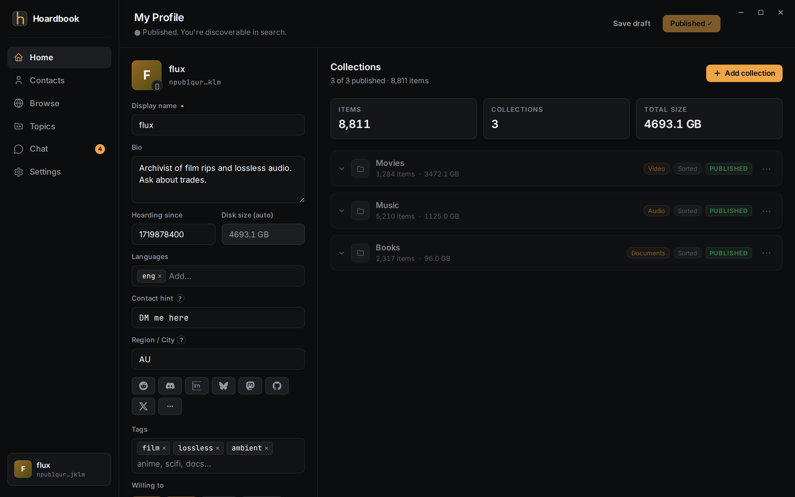
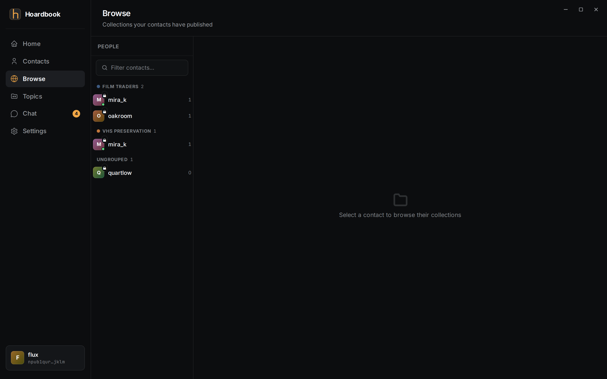
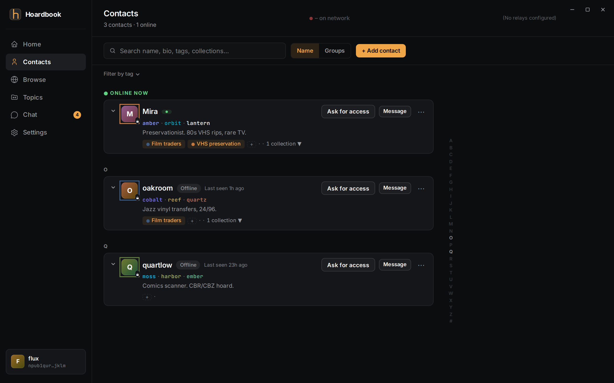
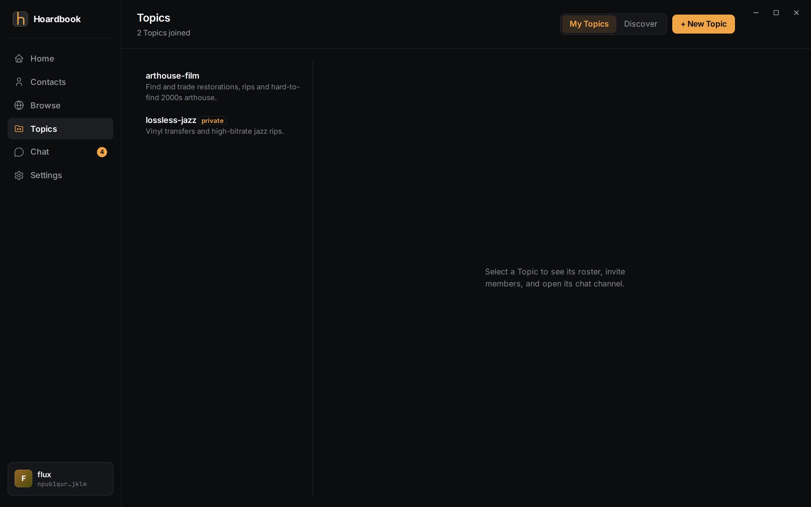
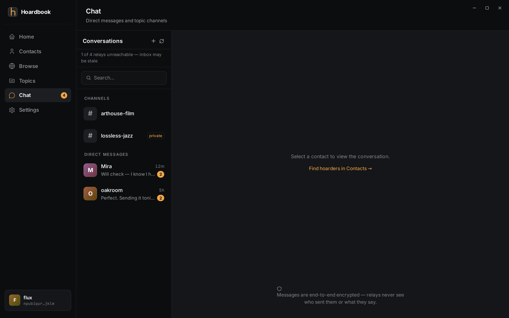

# Hoardbook

[](https://github.com/Arsinine/Hoardbook/actions/workflows/ci.yml)
[](https://github.com/Arsinine/Hoardbook/releases)

Hoardbook is a desktop directory for media hoards. Point it at your disks, publish an
encrypted catalog, and other collectors can find out *that* you have something and *who*
you are — without you exposing a server, an IP address, or the files themselves. Find who
has what, verify who they are, then talk to them and arrange the trade however you like.

It is a phonebook, not a courier: Hoardbook moves no collection files. Even its built-in
peer transport is structurally limited to manifest payloads (the list of what you offered),
never your media.

## Screenshots

| Home — your published profile | Browse — a peer's catalog |
|:---:|:---:|
|  |  |

| Contacts — fingerprints & presence | Topics — public & private channels |
|:---:|:---:|
|  |  |

| Chat — sealed direct messages |
|:---:|
|  |

## How it works

For a technical reader, in one line: **Hoardbook is a Nostr client — your identity is a
Nostr keypair, your catalog is an encrypted event published to public relays, and direct
messages are NIP-17 sealed DMs, so discovery needs none of your own servers and exposes
no peer addresses.**

- **Identity is a key, not an account.** First run generates your Nostr key (your `npub`).
  No email, no sign-up, nothing to delete.
- **Catalogs are sealed.** Each collection's directory tree is encrypted before it leaves
  your machine. The decryption key (your *browse-key*) never leaves the device unsealed —
  it travels only inside an `hbk…` share code you hand to a specific person.
- **Browsing is relay-read + local-decrypt.** You pull encrypted events from relays and
  open them locally. Peers never learn your address, and you never learn theirs.
- **Fingerprints beat impersonation.** Every contact carries a word + colour fingerprint
  derived from their key, rendered identically on both ends. A lookalike name with a
  different fingerprint is not them.
- **Private collections have an explicit audience.** Who can see a private collection is
  a list you control — never inferred from groups or topic membership.
- **Trades happen out of band.** Hoardbook brokers the introduction and the catalog;
  how bytes move between two collectors is up to them.

## Quick start

1. **Install.** Grab the Windows installer or Linux package from
   [Releases](https://github.com/Arsinine/Hoardbook/releases). macOS is not supported.
2. **Generate your identity.** The first-run wizard creates your Nostr key and shows you
   your `npub` — that string *is* your address. Back it up; there is no reset.
3. **Add a contact.** In Contacts, paste their `npub`, or import their `hbk…` share code
   (an `npub` plus the browse-key that unlocks their catalog for you).
4. **Scan your hoard.** Add a collection and point it at a directory. Hoardbook indexes
   the tree locally; you choose what to publish and to whom.
5. **Browse and talk.** The Browse tab lists catalogs you hold keys for — open one to walk
   its tree. Chat opens a sealed, end-to-end encrypted thread with that collector.

## Relays

Discovery rides on public Nostr relays. Hoardbook ships with four defaults spread across
independent providers, so no single relay is a point of failure:

- `wss://nos.lol`
- `wss://relay.primal.net`
- `wss://relay.snort.social`
- `wss://offchain.pub`

Replace or extend them in Settings; Hoardbook reads from all configured relays.

## Build from source

Requires [Rust](https://rustup.rs) and Node.js.

```sh
git clone https://github.com/Arsinine/Hoardbook.git
cd Hoardbook/crates/hb-app/ui
npm install
cd ../..
cargo tauri dev --manifest-path crates/hb-app/Cargo.toml
```

Build an installer:

```sh
cargo tauri build --manifest-path crates/hb-app/Cargo.toml
```

## Privacy model

The guarantees above are not aspirations — they are pinned by tests in this repository:

- The browse-key never leaves the device unsealed (INV-2).
- Presence and browsing carry no addresses or node keys — the historical IP-harvest hole
  is closed and stays closed.
- Durable deletion is deliberate: removing a collection removes its catalog, never your
  files (INV-8).
- Every plaintext-transport sweep and wire-format change is guarded in CI.

These invariants are stated and enforced as first-class rules in this repository's
development documentation and test suite.

## License

MIT.
